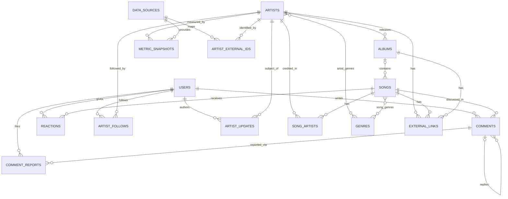

# Entity Relationship Diagram

```mermaid
erDiagram
    USERS ||--o{ COMMENTS : writes
    USERS ||--o{ REACTIONS : gives
    USERS ||--o{ ARTIST_FOLLOWS : follows
    USERS ||--o{ COMMENT_REPORTS : files
    USERS ||--o{ ARTIST_UPDATES : authors
    ARTISTS ||--o{ ARTIST_FOLLOWS : followed_by
    ARTISTS ||--o{ ALBUMS : releases
    ARTISTS ||--o{ SONG_ARTISTS : credited_in
    SONGS ||--o{ SONG_ARTISTS : has
    ALBUMS |o--o{ SONGS : contains
    ARTISTS }o--o{ GENRES : artist_genres
    SONGS }o--o{ GENRES : song_genres
    SONGS ||--o{ COMMENTS : discussed_in
    COMMENTS ||--o{ COMMENT_REPORTS : reported_via
    COMMENTS |o--o{ COMMENTS : replies
    SONGS ||--o{ REACTIONS : receives
    ARTISTS ||--o{ ARTIST_UPDATES : subject_of
    ARTISTS ||--o{ METRIC_SNAPSHOTS : measured_by
    DATA_SOURCES ||--o{ METRIC_SNAPSHOTS : provides
    DATA_SOURCES ||--o{ ARTIST_EXTERNAL_IDS : maps
    ARTISTS ||--o{ ARTIST_EXTERNAL_IDS : identified_by
    ARTISTS ||--o{ EXTERNAL_LINKS : has
    SONGS ||--o{ EXTERNAL_LINKS : has
    ALBUMS ||--o{ EXTERNAL_LINKS : has
```